# OPC-UA Interface

## Connection with UaExpert
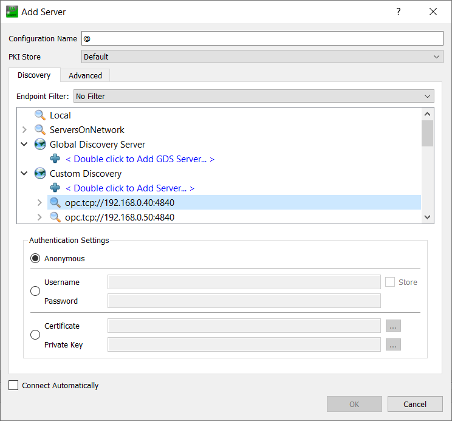

## Signals Delivery and Pickup Station (DPS)
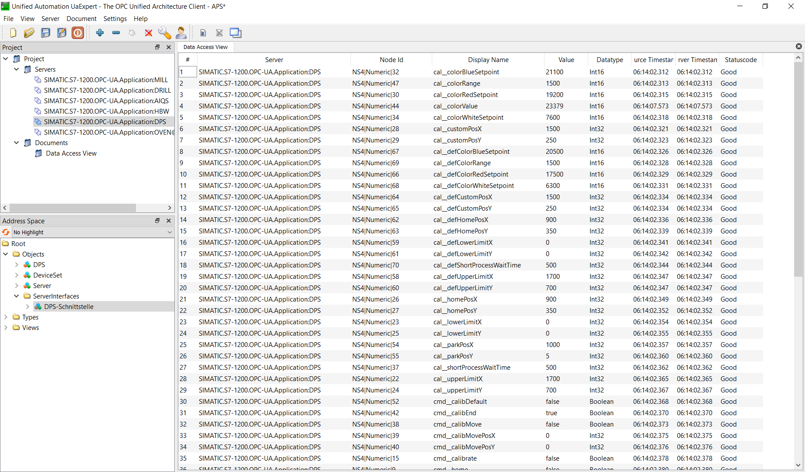
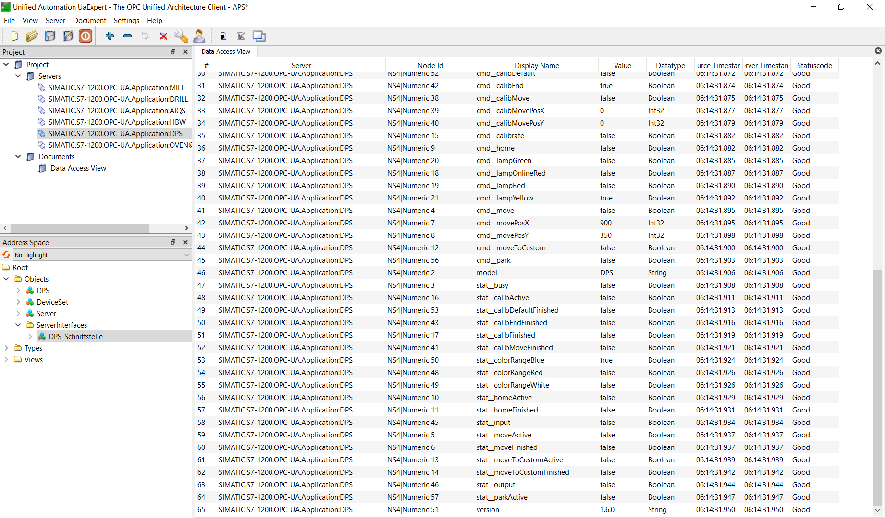

## Signals Quality Control with AI (AIQS)
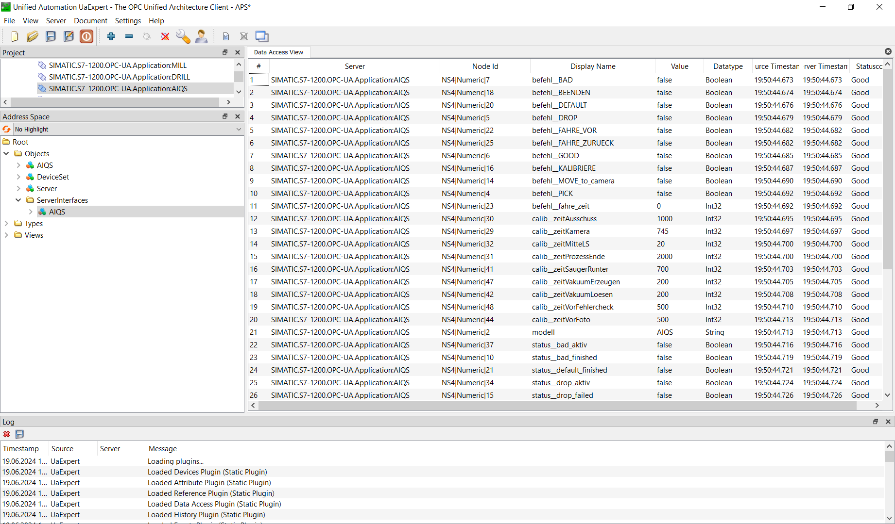
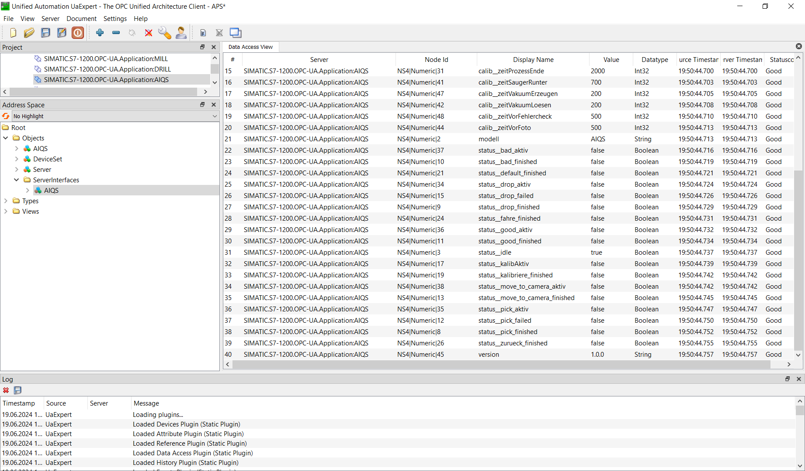

## Signals High-Bay Warehouse (HBW)
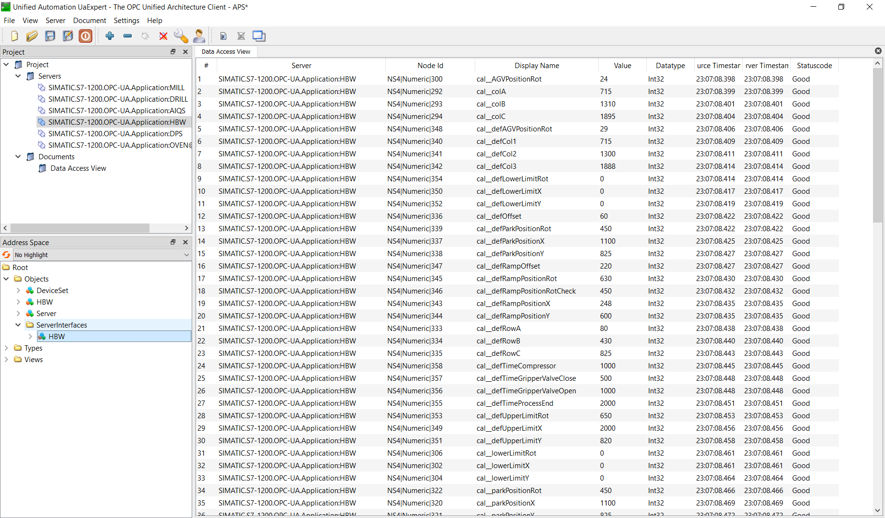
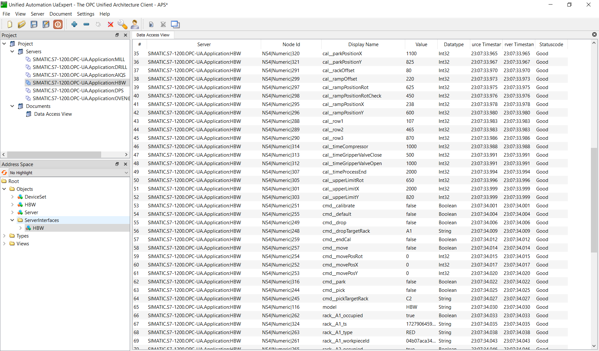
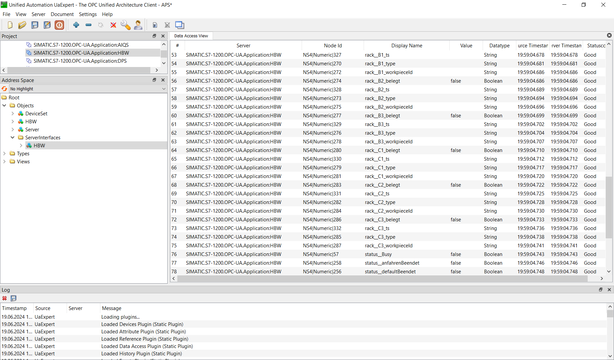
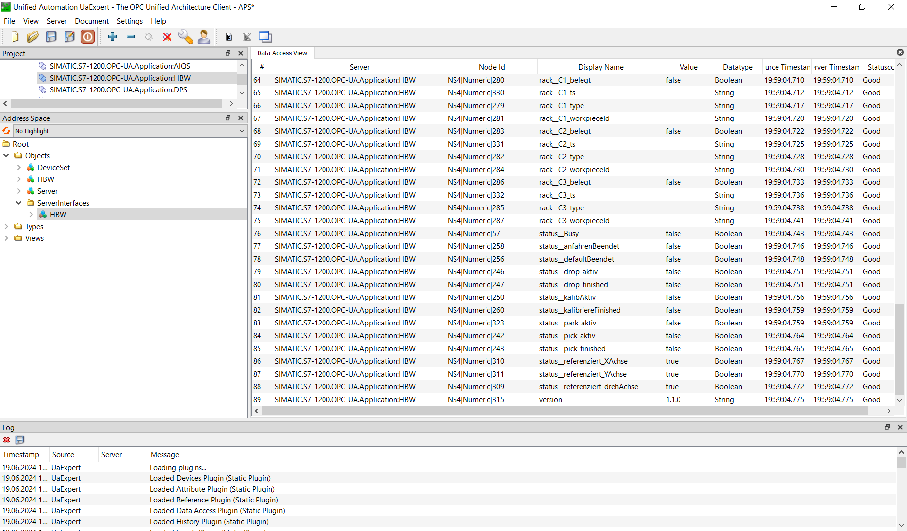

## Signals Drilling Station (DRILL)
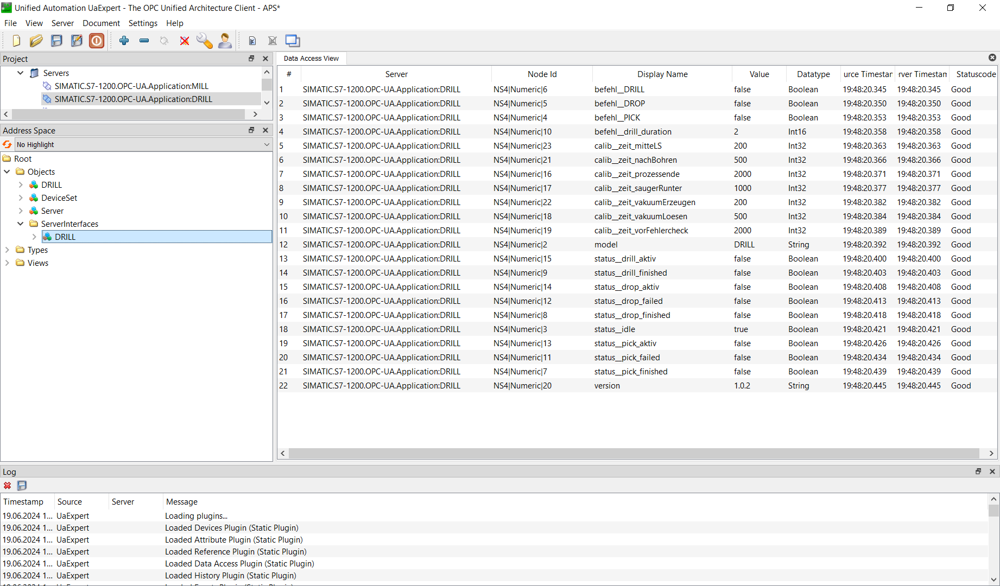

## Signals Milling Station (MILL)
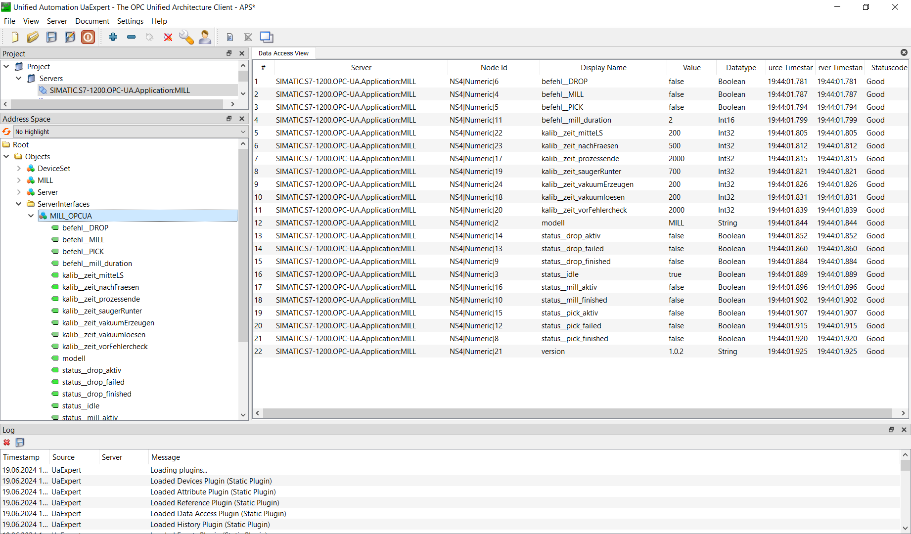

## Signals Hardening Furnace (OVEN)
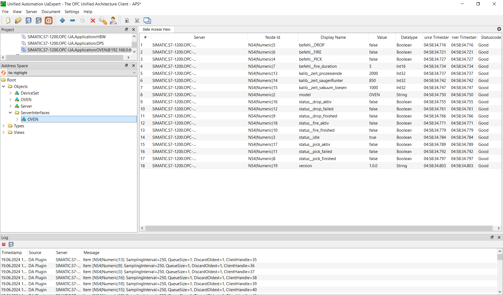
